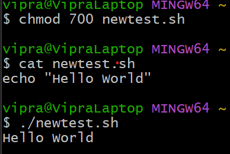

# shebang_linux
# What is Shebang?
The shebang has a special meaning when it is used in the very first line of the script.It is the combination of the # (pound key) and ! (exclamation mark). It is used to specify the interpreter with which the given script will be run by default.
For Example: If the first line of script is:

    
    #!/bin/bash...

It means the interpreter is bash shell.

If the first line of script is: 

     #!/bin/zsh

It means the interpreter is Z shell.
**
What happens when we dont use shebang?**
1. First create newtest.sh file
2. Then write simple script
     echo "Hello World"
3. Now give permission to execute and run it
4. Now run the script ./newtest.sh

